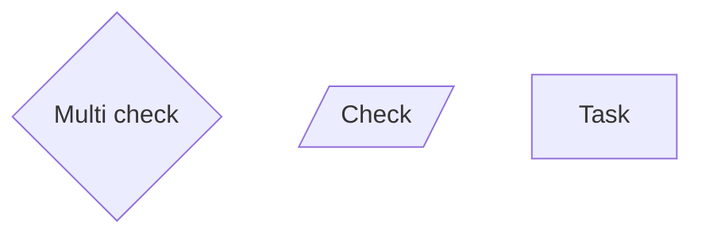
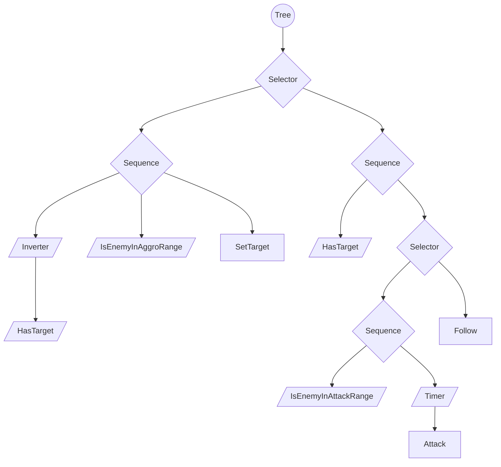

# Behavoir trees

Legenda:

```mermaid
flowchart TD
    MultiCheck{Multi check}
    Check[/Check/]
    Task[Task]
```

## Units

### Swordsman

```mermaid
flowchart TD
Tree((Tree))
  Selector1{Selector}
    Sequence1{Sequence}
      Inverter1[/Inverter/]
        HasTarget1[/HasTarget/]
      IsEnemyInAggroRange1[/IsEnemyInAggroRange/]
      SetTarget[SetTarget]
    Sequence3{Sequence}
      HasTarget2[/HasTarget/]
      Selector2{Selector}
        Sequence4{Sequence}
        IsEnemyInAttackRange[/IsEnemyInAttackRange/]
        Timer[/Timer/]
          Attack[Attack]
        Follow[Follow]

Tree --> Selector1
  Selector1 --> Sequence1
    Sequence1 --> Inverter1
    Inverter1 --> HasTarget1
    Sequence1 --> IsEnemyInAggroRange1
    Sequence1 --> SetTarget
  Selector1 --> Sequence3
    Sequence3 --> HasTarget2
    Sequence3 --> Selector2
      Selector2 --> Sequence4
        Sequence4 --> IsEnemyInAttackRange
        Sequence4 --> Timer
          Timer --> Attack
      Selector2 --> Follow
 
```