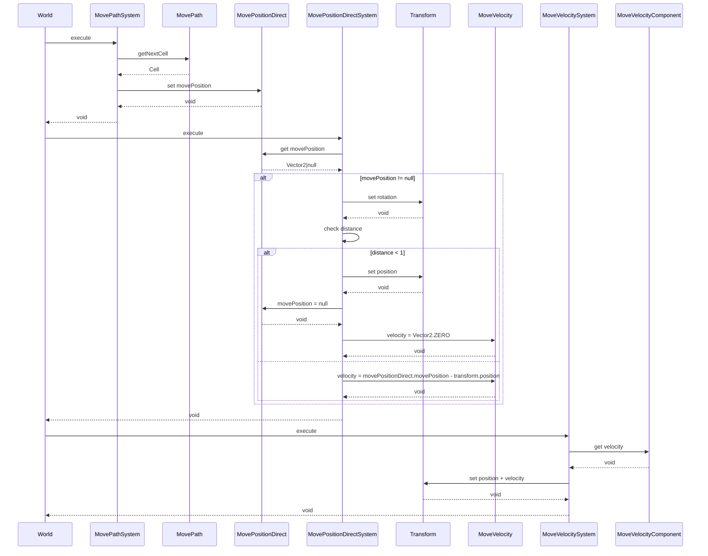

# Movement

This page documents the movement flow inside.

Other actions are left out from this uml to keep the focus on movement.

```mermaid

sequenceDiagram

  World ->> MovePathSystem: execute
  MovePathSystem ->> MovePath: getNextCell
  MovePath -->> MovePathSystem: Cell
  MovePathSystem ->> MovePositionDirect: set movePosition
  MovePositionDirect -->> MovePathSystem: void
  MovePathSystem -->> World: void
  
  World ->> MovePositionDirectSystem: execute
  MovePositionDirectSystem ->> MovePositionDirect: get movePosition
  MovePositionDirect -->> MovePositionDirectSystem: Vector2|null
  alt movePosition != null
    MovePositionDirectSystem ->> Transform: set rotation
    Transform -->> MovePositionDirectSystem: void
    MovePositionDirectSystem ->> MovePositionDirectSystem: check distance
    alt distance < 1
      MovePositionDirectSystem ->> Transform: set position
      Transform -->> MovePositionDirectSystem: void
      MovePositionDirectSystem ->> MovePositionDirect: movePosition = null
      MovePositionDirect -->> MovePositionDirectSystem: void
      MovePositionDirectSystem ->> MoveVelocity: velocity = Vector2.ZERO
      MoveVelocity -->> MovePositionDirectSystem: void
    else
      MovePositionDirectSystem ->> MoveVelocity: velocity = movePositionDirect.movePosition - transform.position
      MoveVelocity -->> MovePositionDirectSystem: void
    end
  end
  MovePositionDirectSystem -->> World: void
  
  World ->> MoveVelocitySystem: execute
  MoveVelocitySystem ->> MoveVelocityComponent: get velocity
  MoveVelocityComponent -->> MoveVelocitySystem: void
  MoveVelocitySystem ->> Transform: set position + velocity
  Transform -->> MoveVelocitySystem: void
  MoveVelocitySystem -->> World: void


```